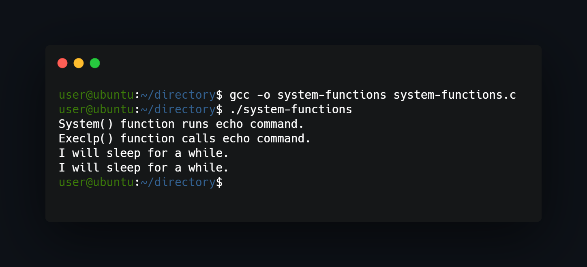

## What project do?
___
Simple program forks itself into parent-child configuration, then parent and child invidually call for system commnads by various functions.



## How to use?
___
Just compile and run:
```
gcc -o system-functions system-functions.c 
./system-functions 
```


<!--https://banner.godori.dev/ height:150-->
<!--https://shields.io/-->
<!--https://carbon.now.sh/-->